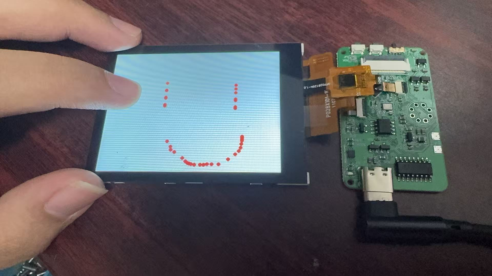
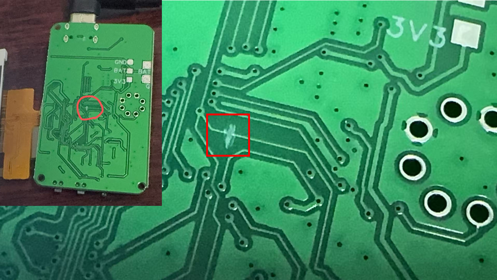

# 第九课 - 触摸屏驱动

在第二课中，我们成功点亮了屏幕，并让可爱的初音未来出现在了眼前。但一块只能"看"不能"摸"的屏幕是没有灵魂的！今天，我们要给这块屏幕装上"触觉神经"——**驱动 FT6336U 电容触摸芯片，让你的手指能在屏幕上自由戳戳点点，还能实时在串口监视器上看到坐标和手势！**

FT6336U 是一款非常经典的电容式触摸控制芯片，通过 I2C 协议与 ESP32 通信。别看它只有小小一片，它内部集成了触摸检测、坐标计算、手势识别（上下左右滑动、长按等）等一整套算法。我们只需要通过 I2C "问"它："现在有没有人在摸？摸在哪？"，它就会把整理好的数据乖乖送过来。




注意，早期设计的电路板中，由于一个无用的线路错误接线，会导致接入触摸屏时一点击就会重启，如果使用触摸屏，需要在这里割断这根没有被使用的线缆，就能正常使用了。



---

## ✨ 本节课解锁的新技能

1. 🔌 **I2C 设备扫描与通信**：用 `Wire1` 总线探测 FT6336U 是否存在，并读写寄存器。
2. 👆 **FT6336U 触摸驱动开发**：从芯片初始化、坐标读取到手势识别的完整流程。
3. 🎯 **回调函数机制 (Callback)**：把"触摸事件"和"屏幕绘制"解耦，让代码更优雅。
4. 🤝 **软硬件状态联动**：触摸芯片不在线？屏幕会立即用黑白双色给你直观的反馈！

---

## 📂 项目结构解析

展开 `src` 文件夹，来看看我们今天的新朋友：

* **`main.cpp`**：主入口。初始化串口、屏幕、触摸，并把"触摸回调"绑定到"屏幕绘制"上。
* **`touch.hpp`**：【新朋友】触摸业务的"大管家"。负责芯片上电、I2C 扫描、坐标转换、手势识别和回调分发。
* **`FT6336U.h / FT6336U.cpp`**：【硬核驱动】FT6336U 芯片的底层 I2C 通信库。包含寄存器读取、设备扫描、单点/双点坐标解析。
* **`screen.hpp`**：【老朋友】屏幕驱动，这节课它负责配合触摸，在你手指戳中的位置画下小红点！

---

## ⚙️ 驱动原理：三步让屏幕"感受"到你的手指

### 第一步：I2C 扫描，确认芯片在线

FT6336U 的 I2C 地址固定为 `0x38`。在 `touch.hpp` 中，我们先给触摸芯片上电，然后通过 `scan_device()` 在总线上"喊一嗓子"：

```cpp
bool touch_init(){
    i2c_pullup();                    // 给触摸芯片上电
    delay(500);
    if (!touch_dev.scan_device()){   // I2C 扫描，1秒超时
        Serial.println("FT6336U not found!");
        return false;
    }else{
        Serial.println("FT6336U found!");
        touch_dev.begin();           // 确认在线后，再执行引脚复位和初始化
        touch_dev._touch_init_done = true;
        return true;
    }
}
```

### 第二步：读取坐标与手势

`touch_loop()` 会以极高的频率调用 `touch_dev.update()`，后者从芯片寄存器中扒出原始坐标：

```cpp
void touch_loop(){
    if (!touch_dev._touch_init_done) return;
    touch_dev.update();
    if (touch_dev.tp.touching) {
        int x = touch_dev.tp.y;           // 芯片 Y → 屏幕 X
        int y = 240 - touch_dev.tp.x;     // 芯片 X 翻转 → 屏幕 Y
        Serial.printf("[TOUCH](%d, %d)\n", x, y);
    }
}
```

这里有一个关键的坐标映射：FT6336U 上报的坐标轴和屏幕的物理方向并不一致，而且还需要做翻转（`240 - tp.x`），才能让"手指向上滑"对应"屏幕上的向上"。

### 第三步：回调机制——触摸和绘制互不干扰

我们不想把"怎么画"的逻辑塞到触摸驱动里。于是 `touch.hpp` 提供了一个回调接口：

```cpp
typedef void (*touch_cb_t)(int x, int y);
void set_touch_cb(touch_cb_t cb);
```

在 `main.cpp` 中，我们只需要写一个简单的绘制函数，然后"注册"进去：

```cpp
void draw_touch_cb(int x, int y) {
    tft.fillCircle(x, y, 3, TFT_RED);  // 在触摸位置画个红点
}

void setup() {
  // ... 其他初始化 ...
  set_touch_cb(draw_touch_cb);
}
```

这样一来，触摸模块只负责"感知"，绘制模块只负责"画画"，两者通过回调函数优雅地协作。

---

## 🚀 动手测试：戳戳点点，看串口！

用数据线连上你的 ESP32 板子：

1. 点击底部工具栏的 **✓ (编译)** 按钮。
2. 看到绿色的 `SUCCESS` 后，点击 **→ (烧录)** 按钮。

烧录完成后，屏幕会先显示 Miku，然后：
* 如果 FT6336U 被成功找到，屏幕会切为**白色**。
* 如果芯片没找到（比如排线松了），屏幕会切为**黑色**，并在正中央显示 `TOUCH SCREEN NOT FOUND !`。

### 👆 体验触摸

1. **用手指在屏幕上任意滑动、点击、长按。**
2. 观察屏幕：你的手指划过的地方会留下红色的小圆点！
3. 点击底部的 **🔌 (插头图标)** 打开串口监视器，你会看到实时的坐标流：
   ```
   [TOUCH](120, 80)
   [TOUCH](125, 85)
   [TOUCH] Slide Up
   [TOUCH](130, 70)
   ```
4. 试试各种手势：**上下左右滑动**、**长按**，看看串口会不会正确识别并打印出来！

---

## 🐞 进阶避坑指南 (写给想深入研究的你)

如果你打开源码仔细研究，有几个设计细节值得品味：

1. **坐标轴的旋转与翻转**：`touch.hpp` 里的 `int y = 240 - touch_dev.tp.x;` 不是随便写的。FT6336U 的原始坐标系和屏幕的物理方向往往相差 90 度，而且还需要翻转 Y 轴，才能让你手指的"上"对应屏幕的"上"。如果你发现触摸方向和光标方向相反，改这里就对了。

2. **手势的阈值**：`FT6336U::update()` 中，滑动识别阈值是 100 个像素。也就是说，手指必须划够 100 像素，才会被判定为一次"Slide"。这个值可以根据你的屏幕尺寸和使用习惯调整。

---

## 🎉 第九课总结

恭喜你！你的屏幕终于不再是一块"冰冷的玻璃"了。你不仅掌握了 I2C 设备的扫描与通信，还亲手实现了一套完整的触摸驱动——从芯片探测、坐标读取、手势识别，到通过回调函数把触摸事件优雅地传递到 UI 层。

现在，你可以用手指在屏幕上画画、做按钮、做手势操控……交互的世界已经向你敞开大门！

在下一课中，我们将挑战更有意思的传感器，敬请期待！
